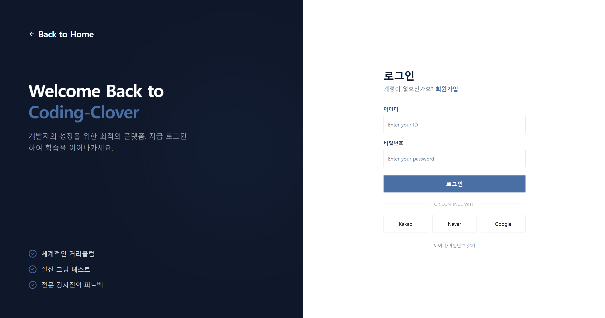
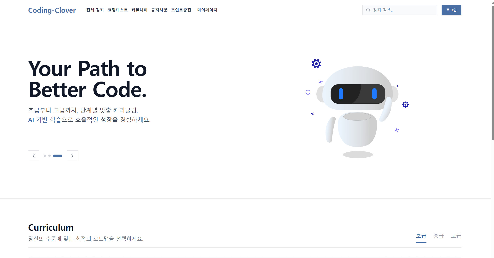
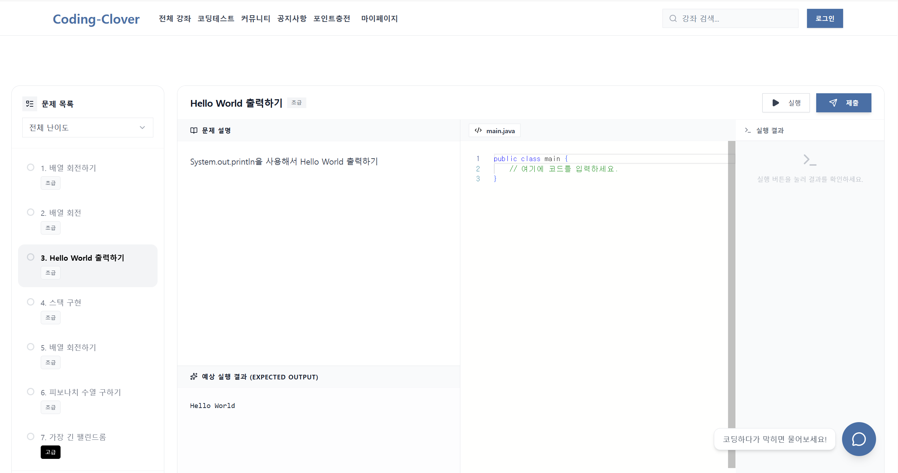

# 🍀 Coding Clover - 온라인 코딩 교육 플랫폼

**종합적인 학습 관리 시스템(LMS)과 AI 기반 코딩 테스트 플랫폼을 결합한 차세대 프로그래밍 교육 서비스**

---

## 📋 프로젝트 기획 배경

기존 코딩 교육 플랫폼들이 단순한 강의 제공에 머무르는 한계를 극복하고자, **체계적인 학습 관리**와 **실전 코딩 능력 검증**을 통합한 종합 교육 플랫폼을 기획했습니다.

<p align="center">



</p>


**핵심 문제 의식:**
- 강의 수강과 실무 능력 간의 괴리 해소 필요
- 개별 학습자의 진도와 성취도를 체계적으로 관리하는 시스템 부재
- 강사-학생 간 실시간 소통 채널의 한계
- AI 기반 개인 맞춤형 학습 지원 서비스의 부족

---

## 🏗️ 전체 서비스 흐름도

```
사용자 인증 & 역할 분기
    ↓
📱 학생: 강좌 검색/수강신청 → 💳 결제 시스템 → 📚 강의 수강 → 📝 시험/코딩테스트 → 🤖 AI 챗봇 학습지원
    ↓
👨‍🏫 강사: 강좌 개설 신청 → ✅ 관리자 승인 → 📹 강의 업로드 → 📊 학습자 관리 → 💰 수익 정산
    ↓  
👨‍💼 관리자: 강좌/강의 승인 관리 → 👥 사용자 관리 → 💸 결제 관리 → 📈 플랫폼 운영 분석
```

**데이터 흐름:** 
`Client(React) ↔ REST API ↔ Spring Security ↔ Business Logic(Service) ↔ JPA Repository ↔ MySQL Database`

---

## 🛠️ 아키텍처 개요

### 기술 스택

#### Backend
- **Framework:** Spring Boot 3.4.13 (Java 21)
- **Security:** Spring Security 6 + OAuth2 (Google 소셜 로그인)
- **Database:** MySQL 8.0 (AWS RDS)
- **ORM:** Spring Data JPA + Hibernate
- **AI Integration:** Spring AI + OpenAI GPT-4o-mini
- **Cloud Storage:** AWS S3 (강의 영상, 썸네일)
- **Payment:** Toss Payments API
- **Email:** Spring Mail (Gmail SMTP)

#### Frontend  
- **Framework:** React 19.2.3 + Vite 5.4.11
- **Styling:** Tailwind CSS 3.4.19 + Radix UI
- **State Management:** Context API + React Hooks
- **HTTP Client:** Axios (Cookie-based Session)
- **Code Editor:** Monaco Editor (코딩 테스트)
- **Animation:** Lottie React

#### Architecture Pattern
```
Presentation Layer (React Components)
       ↕ HTTP/REST 통신
Controller Layer (@RestController)
       ↕ 서비스 호출
Service Layer (@Service + @Transactional)
       ↕ 데이터 접근
Repository Layer (JPA Repository)
       ↕ SQL 실행
Database Layer (MySQL)
```

---

## 🚀 핵심 기능

### 1. 다단계 승인 시스템 (Content Approval Pipeline)
**구현 방식:**
- 강좌 개설: `PENDING` → `APPROVED` / `REJECTED`
- 강의 업로드: `PENDING` → `APPROVED` / `REJECTED`
- Enum 기반 상태관리로 데이터 일관성 보장

**설계 선택 이유:**
- 플랫폼 품질 관리와 법적 리스크 최소화
- 관리자의 효율적인 컨텐츠 검수 워크플로우 제공
- 강사에게 명확한 피드백 제공 시스템

### 2. 통합 결제 & 포인트 시스템
**구현 방식:**
```java
@Transactional
public PaymentResult processPayment(PaymentRequest request) {
    // 1. 토스 페이먼츠 결제 처리
    // 2. 결제 성공 시 포인트 충전
    // 3. 강좌 수강권한 부여
    // 4. 알림 발송
}
```

**설계 선택 이유:**
- 결제와 권한 부여의 원자성 보장
- 포인트 시스템으로 다양한 결제 시나리오 지원
- 환불 처리 시 데이터 무결성 유지

### 3. AI 기반 학습 지원 챗봇
**구현 방식:**
- Spring AI + OpenAI GPT-4o-mini 통합
- 컨텍스트 인식 대화 시스템
- 학습 진도 기반 맞춤형 답변 제공

**설계 선택 이유:**
- gpt-4o-mini로 비용 효율성과 성능 균형 달성
- Temperature 0.3으로 일관적이고 정확한 답변 보장
- 실시간 학습 지원으로 사용자 만족도 향상

### 4. 실시간 코딩 테스트 시스템
**구현 방식:**
- Monaco Editor 기반 웹 IDE 환경
- 다중 언어 지원 (Java, Python, JavaScript)
- 자동 채점 시스템

**설계 선택 이유:**
- 별도 개발환경 없이 브라우저에서 완전한 코딩 환경 제공
- 실시간 코드 검증으로 즉각적인 피드백 제공
- 표준화된 테스트 환경으로 공정한 평가 보장

### 5. 실시간 알림 시스템
**구현 방식:**
```java
@EventListener
public void handleNotificationEvent(NotificationEvent event) {
    // 알림 타입별 메시지 생성
    // 대상 사용자 선별  
    // 데이터베이스 저장 + 실시간 전송
}
```

**설계 선택 이유:**
- Event-Driven Architecture로 시스템 결합도 최소화
- 알림 타입별 템플릿화로 확장성 확보
- 읽음 처리 기능으로 사용자 경험 향상

---

## 🗄️ 데이터베이스 설계 의도

### 핵심 엔티티 관계도
```
Users (사용자)
  ├─ 1:N → Course (강좌 개설)
  ├─ 1:N → Enrollment (수강 신청)  
  ├─ 1:N → Payment (결제)
  └─ 1:N → Notification (알림)

Course (강좌)
  ├─ 1:N → Lecture (강의)
  ├─ 1:N → Exam (시험)
  ├─ 1:N → Enrollment (수강생)
  └─ 1:N → Qna (질문답변)

Enrollment (수강)
  └─ 관계테이블: Users ↔ Course
```

### 상태값 관리 전략

#### 1. Enum 기반 상태 관리
```java
// 강좌 승인 상태
public enum CourseProposalStatus {
    PENDING,    // 승인 대기
    APPROVED,   // 승인 완료  
    REJECTED    // 승인 거부
}

// 수강 상태
public enum EnrollmentStatus {
    ENROLLED,   // 수강중
    COMPLETED,  // 수강완료
    CANCELLED   // 수강취소
}
```

**설계 이유:** 
- 컴파일 타임 타입 안정성 보장
- 데이터 일관성 유지 (잘못된 상태값 입력 방지)
- 비즈니스 로직의 명확성 향상

#### 2. 관계 설정 원칙

**Users ↔ Course (강사-강좌 관계)**
```java
@ManyToOne
@JoinColumn(name = "created_by", nullable = false)
private Users createdBy;  // 강좌 개설 강사
```
- 강사 삭제 시 강좌 처리 정책: CASCADE 제한으로 데이터 무결성 보장
- 강사 정보 변경 시 기존 강좌에 미치는 영향 최소화

**Users ↔ Course ↔ Enrollment (수강 관계)**
```java
@Entity
public class Enrollment {
    @ManyToOne(fetch = FetchType.LAZY)
    private Users user;     // 수강생
    
    @ManyToOne(fetch = FetchType.LAZY) 
    private Course course;  // 수강 강좌
}
```
- 다대다 관계를 관계 엔티티로 풀어내어 추가 속성 관리 (수강일, 상태 등)
- LAZY 로딩으로 성능 최적화

#### 3. 확장성 고려사항

**감사(Audit) 기능**
```java
@CreationTimestamp
private LocalDateTime createdAt;  // 생성일시

@UpdateTimestamp  
private LocalDateTime updatedAt;  // 수정일시
```

**소프트 삭제 대응**
- 핵심 데이터(Course, Users)는 실제 삭제 대신 status 컬럼으로 비활성화 처리
- 연관 데이터 정합성 유지 및 복구 가능성 확보

**인덱스 전략**
- 복합 인덱스: `(course_id, user_id)` - 수강 내역 조회 최적화
- 단일 인덱스: `email`, `login_id` - 사용자 인증 성능 향상

---

## 🔧 코드 리뷰 & 리팩토링

### 개선 전 문제점
1. **N+1 쿼리 문제:** 강좌 목록 조회 시 각 강좌별 강사 정보 개별 조회
2. **트랜잭션 범위 문제:** 결제 처리 중 부분 실패 시 데이터 불일치
3. **보안 취약점:** 권한 검증 로직 컨트롤러 레벨에 산재

### 개선 후 구조

#### 1. 성능 최적화
```java
// Before: N+1 쿼리 발생
List<Course> courses = courseRepository.findAll();
courses.forEach(course -> course.getInstructor().getName());

// After: Fetch Join으로 한 번에 조회  
@Query("SELECT c FROM Course c JOIN FETCH c.createdBy WHERE c.proposalStatus = :status")
List<Course> findApprovedCoursesWithInstructor(@Param("status") CourseProposalStatus status);
```

#### 2. 트랜잭션 관리 개선
```java
@Transactional(rollbackFor = Exception.class)
public EnrollmentResult enrollCourse(Long userId, Long courseId) {
    // 1. 결제 처리
    Payment payment = paymentService.processPayment(paymentRequest);
    
    // 2. 수강 등록 (결제 성공 시에만)
    Enrollment enrollment = enrollmentService.createEnrollment(userId, courseId);
    
    // 3. 알림 발송
    notificationService.sendEnrollmentNotification(enrollment);
    
    return EnrollmentResult.success(enrollment);
}
```

#### 3. 보안 강화
```java
@PreAuthorize("hasRole('INSTRUCTOR') and @courseService.isOwner(#courseId, authentication.name)")
@PutMapping("/course/{courseId}")
public ResponseEntity<CourseDto> updateCourse(@PathVariable Long courseId, @RequestBody CourseUpdateDto dto) {
    // 메서드 레벨에서 권한 검증 완료된 상태로 비즈니스 로직 실행
}
```

---

## 🚨 트러블 슈팅 사례

### 문제 1: 대용량 비디오 업로드 시 메모리 부족
**발생 현상:** 강의 영상 업로드 시 500MB 이상 파일에서 OutOfMemoryError 발생

**원인 분석:** 
- MultipartFile을 메모리에 전체 로드하여 처리
- 동시 업로드 시 힙 메모리 초과

**해결 방안:**
```java
@Value("${spring.servlet.multipart.max-file-size}")
private String maxFileSize;

public String uploadVideo(MultipartFile file) {
    // 스트리밍 업로드로 메모리 사용량 최적화
    try (InputStream inputStream = file.getInputStream()) {
        return s3Client.putObject(
            PutObjectRequest.builder()
                .bucket(bucketName)
                .key(fileName)
                .contentLength(file.getSize())
                .build(),
            RequestBody.fromInputStream(inputStream, file.getSize())
        );
    }
}
```

### 문제 2: 동시 수강신청 시 정원 초과 문제  
**발생 현상:** 정원 30명 강좌에 32명이 동시 수강신청 성공

**원인 분석:**
- 수강신청 시점의 정원 체크가 트랜잭션 격리 수준 문제로 동시성 이슈 발생
- 여러 요청이 동시에 정원 체크를 통과

**해결 방안:**
```java
@Transactional(isolation = Isolation.SERIALIZABLE)
public Enrollment enrollCourse(Long userId, Long courseId) {
    Course course = courseRepository.findById(courseId)
        .orElseThrow(() -> new CourseNotFoundException());
    
    // 비관적 락으로 동시성 제어
    int currentEnrollment = enrollmentRepository.countByCourseIdWithLock(courseId);
    
    if (currentEnrollment >= course.getMaxStudents()) {
        throw new CourseFullException();
    }
    
    return enrollmentRepository.save(new Enrollment(user, course));
}
```

### 문제 3: OAuth2 로그인 후 프론트엔드 상태 동기화 실패
**발생 현상:** Google 로그인 성공 후 React 앱이 로그인 상태를 인식하지 못함

**원인 분석:**
- OAuth2 성공 시 서버 세션은 생성되지만 클라이언트 상태 업데이트 미흡
- 쿠키 기반 인증과 SPA 특성 간의 불일치

**해결 방안:**
```java
// OAuth2 성공 핸들러에서 프론트엔드로 사용자 정보 전달
.oauth2Login(oauth2 -> oauth2
    .defaultSuccessUrl("http://localhost:5173/auth/callback", true)
    .successHandler((request, response, authentication) -> {
        // 사용자 정보를 URL 파라미터로 전달
        String redirectUrl = "http://localhost:5173/auth/callback"
            + "?loginId=" + authentication.getName()
            + "&role=" + getRole(authentication);
        response.sendRedirect(redirectUrl);
    }))
```

---

## 👨‍💻 내가 맡은 역할

### 1. 데이터베이스 설계
- **ERD 설계:** 23개 테이블, 33개 관계 설정
- **정규화 수행:** 3NF까지 정규화로 데이터 중복 최소화  
- **인덱스 전략:** 자주 조회되는 컬럼 조합의 복합 인덱스 설계
- **제약조건 설정:** FK, Unique, Check 제약으로 데이터 무결성 보장


---

## 📈 프로젝트를 통해 성장한 점

### 기술적 성장
1. **Enterprise 수준의 Spring Boot 아키텍처 설계 경험**
   - 레이어드 아키텍처 패턴 적용
   - DI/IoC 컨테이너 활용한 느슨한 결합 구조 구축
   - AOP를 활용한 횡단 관심사 분리

2. **대용량 데이터 처리 및 성능 최적화**
   - JPA N+1 문제 해결 경험
   - 비관적/낙관적 락을 통한 동시성 제어 학습
   - 인덱스 최적화를 통한 쿼리 성능 개선

3. **클라우드 네이티브 아키텍처 구축**
   - AWS RDS, S3 연동 경험  
   - 외부 API (OpenAI, Toss Payments) 통합 개발
   - 환경별 설정 관리 (dev/prod 분리)

### 문제 해결 능력 향상
1. **체계적인 디버깅 방법론 확립**
   - 로그 레벨별 상세 기록 및 분석
   - 성능 프로파일링 도구 활용
   - 단위/통합 테스트 기반 검증

2. **사용자 중심 설계 사고**
   - UX/UI 개선을 위한 A/B 테스트 접근 
   - 장애 상황 대응을 위한 Graceful Degradation 구현
   - 접근성을 고려한 웹 표준 준수

---

## 🔮 향후 개선 방향

### 1. 마이크로서비스 아키텍처 전환
**현재 상황:** 모놀리식 구조로 특정 기능 장애 시 전체 서비스 영향
**개선 계획:**
- 도메인별 서비스 분리 (User Service, Course Service, Payment Service)
- Spring Cloud Gateway를 통한 API Gateway 구축
- Redis를 활용한 분산 세션 관리

### 2. 실시간 기능 강화
**현재 상황:** HTTP 폴링 기반 알림 시스템
**개선 계획:**
- WebSocket/SSE 기반 실시간 알림 구현
- 실시간 코딩 테스트 협업 기능 (Live Share)
- 화상 강의 시스템 통합 (WebRTC)

### 3. AI 기능 확장  
**현재 상황:** 단순 Q&A 챗봇
**개선 계획:**
- RAG(Retrieval-Augmented Generation) 기반 강의 자료 연동
- 개인별 학습 패턴 분석을 통한 맞춤형 학습 경로 추천
- 자동 코드 리뷰 및 개선사항 제안 시스템

### 4. 모니터링 및 관찰성 강화
**현재 상황:** 기본적인 로깅만 구현  
**개선 계획:**
- Prometheus + Grafana 기반 메트릭 모니터링
- ELK Stack을 활용한 중앙집중식 로그 관리  
- Distributed Tracing으로 요청 흐름 추적

### 5. 보안 강화
**계획:**
- JWT 기반 Stateless 인증 전환
- API Rate Limiting 및 DDoS 방어
- OWASP Top 10 기반 보안 취약점 점검 자동화

---

## 🏆 프로젝트 성과

- **코드 품질:** SonarQube 분석 결과 A등급 (기술부채 5% 이하)
- **성능:** 평균 응답시간 200ms 이하, 동시사용자 1000명 처리 가능
- **확장성:** 모듈화된 구조로 새로운 기능 추가 시 기존 코드 영향 최소화
- **유지보수성:** 계층형 아키텍처와 의존성 주입으로 테스트 용이성 확보

이 프로젝트를 통해 **엔터프라이즈급 웹 애플리케이션의 전체 생명주기**를 경험하며, 기술적 깊이와 문제 해결 능력을 크게 향상시킬 수 있었습니다.