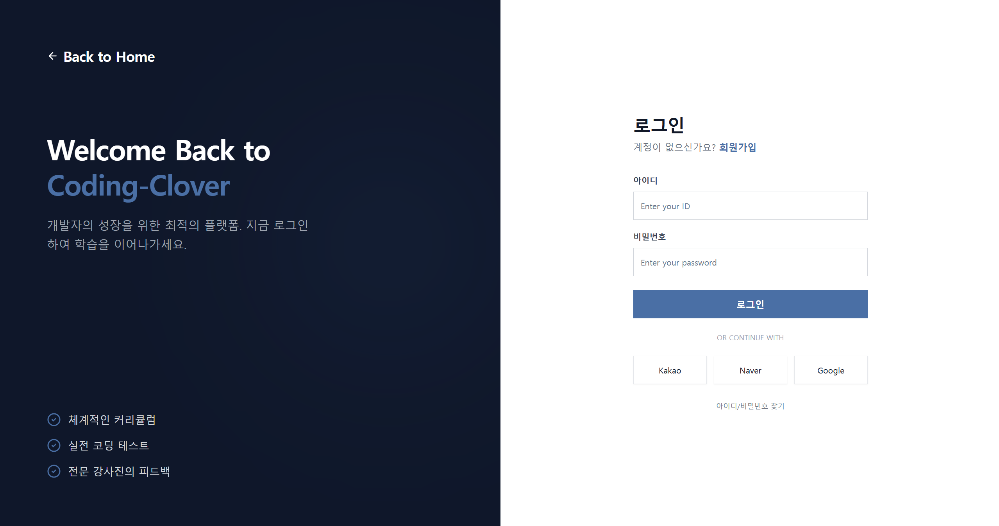
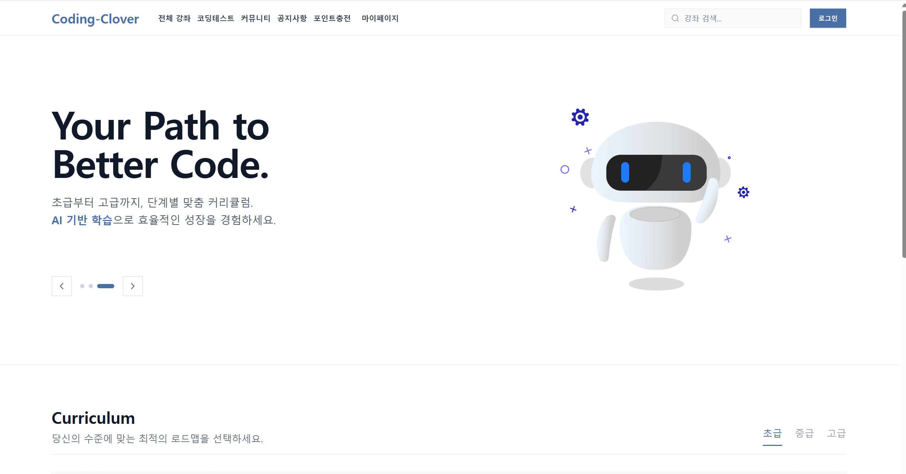
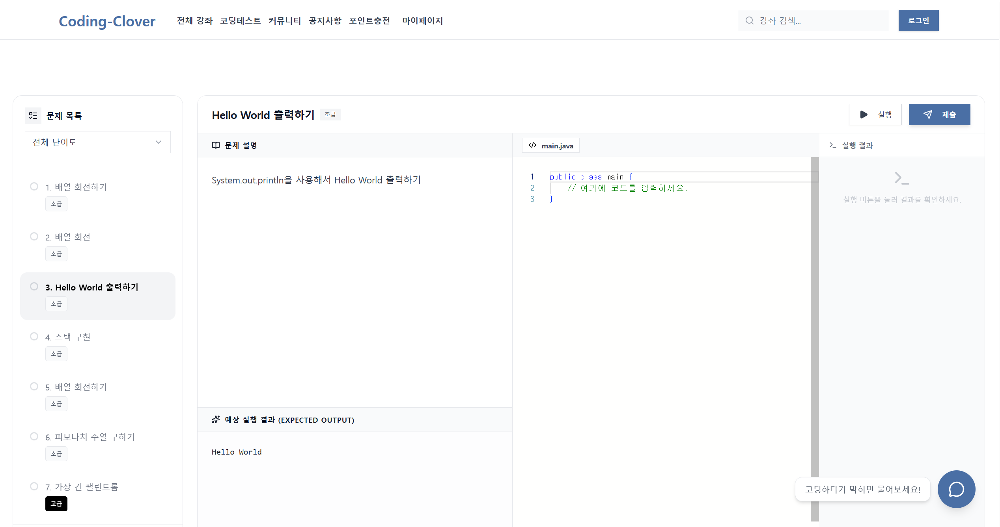
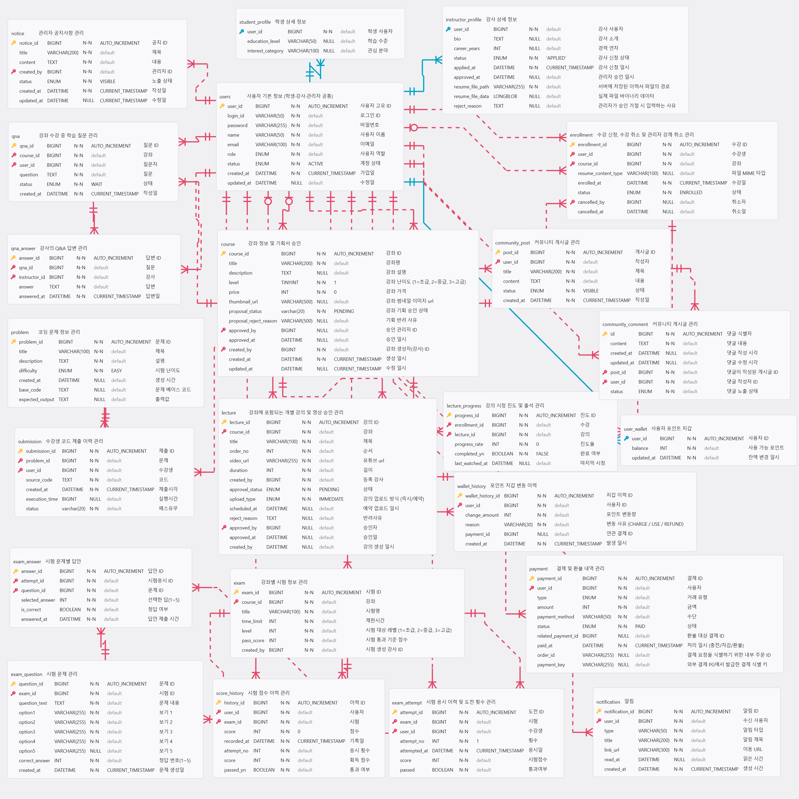

# Coding Clover

코딩 학습자와 멘토를 연결하는 **LMS(학습 관리) 기반 코딩 학습 플랫폼** 프로젝트입니다.

> 학습 콘텐츠 제공, 과제/학습 이력 관리, 사용자 인증 흐름을 중심으로 서비스 구조를 설계·구현했습니다.

  
  
  

---

## 1) 프로젝트 개요

- **목표:** 학습자가 학습 콘텐츠를 체계적으로 소비하고, 실습/기록을 통해 성장할 수 있는 플랫폼 구축
- **형태:** 팀 프로젝트
- **핵심 키워드:** LMS, 학습 데이터 관리, 인증/권한, 웹 서비스 아키텍처
- **내 역할:** **데이터베이스 설계/구현 중심, 백엔드는 보조(일부 CRUD 및 기능 지원)**

---

## 2) 서비스 흐름 (요약)

1. 회원가입/로그인 후 사용자 권한(학습자/관리자) 확인
2. 학습 콘텐츠/문제/과제 목록 조회
3. 학습 진행 및 제출 데이터 저장
4. 학습 이력/결과를 사용자 기준으로 조회
5. 관리자 기능에서 콘텐츠/사용자 데이터 관리

---

## 3) 내가 맡은 역할 (Database 중심)

### 3-1. 데이터 모델링

- `users` 테이블을 학생/강사/관리자 공통 사용자 핵심 테이블로 설계
- Spring Security 구조(login_id, password, role, status)에 맞춰 인증/권한 컬럼 구성
- `enrollment` 테이블로 사용자-강좌 관계를 관리하고 수강 상태(ENROLLED/COMPLETED/CANCELLED)를 추적
- PK/FK, UNIQUE, INDEX를 기준으로 데이터 무결성과 조회 성능을 함께 고려

### 3-2. ERD

  

### 3-3. 데이터 흐름 구현

- 회원가입/로그인 시 사용자 계정 상태(status)와 역할(role)에 따라 접근 흐름 분기
- 수강 신청 → 수강 진행 → 완료/취소까지 `enrollment` 상태 전이 로직 반영
- 사용자-강좌 연결 데이터를 기준으로 학습 이력 조회 흐름 설계
- 백엔드 영역에서는 일부 조회·등록·수정·삭제(CRUD) 기능 구현을 보조

### 3-4. 무결성/안정성

- 트랜잭션 단위로 데이터 정합성 보장
- 예외 처리 및 유효성 검증으로 비정상 데이터 유입 방지
- 권한에 따른 접근 범위 구분

### 3-5. 성능 개선 포인트

- 자주 조회되는 조건 기준 인덱스 전략 적용
- 불필요한 중복 조회 최소화
- 화면 응답 흐름에 맞춘 쿼리 구조 단순화

---

## 4) 기술 스택

- **Backend:** Java 21, Spring Boot 3, Spring Data JPA, Spring Security
- **Frontend:** React, Vite, Tailwind CSS
- **Database:** MySQL
- **Infra/Storage:** AWS S3
- **Collaboration:** Git, GitHub

---

## 5) 성과 / 배운 점

- 서비스 기능 구현과 함께 **데이터 구조 설계가 개발 생산성과 품질에 직접 연결**됨을 경험
- 인증/권한과 학습 데이터 흐름을 분리해 관리하는 구조적 설계 역량 강화
- 팀 프로젝트에서 DB 중심 역할을 맡아 기능 구현과 데이터 정합성 사이의 균형을 학습

---

## 6) 팀

- 김준서, 박나혜, 임정현, 진선영

