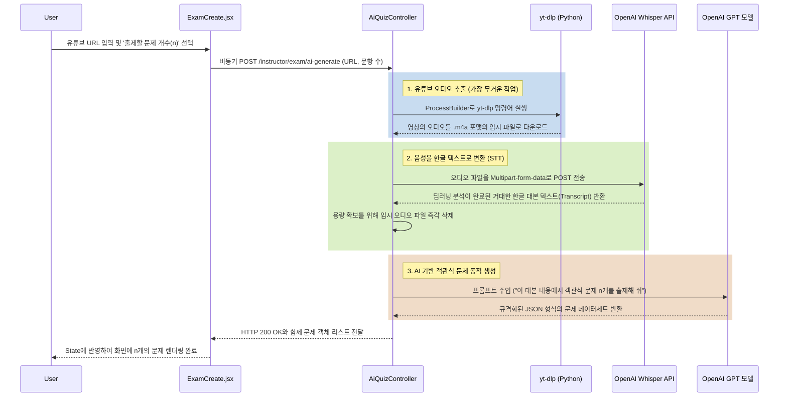

# AI 문제 생성 (YouTube STT 기반) 상세 구현 방식 가이드

이 문서는 자막이 없는 일반 유튜브 영상에서 음성만 추출하고(STT), 이를 OpenAI 모델들에 전달하여 객관식 5지선다 AI 문제를 자동 출제하는 시스템의 **전체 상세 구현 방법과 정보**를 담고 있습니다.

## 📌 1. 전체 아키텍처 흐름 및 시퀀스

사용자가 프론트엔드에서 문제를 생성할 때, 1~2분의 시간 동안 백그라운드에서는 다음과 같은 과정이 일어납니다.



---

## ⚙️ 2. 시스템 요구사항 및 필수 인프라
백엔드 서버(Java Spring Boot) 환경에서 이 파이프라인이 정상 동작하려면 2가지가 필수적으로 설정되어야 합니다.

- **`yt-dlp` (Python 라이브러리)**: 
  - 유튜브의 강력한 동적 암호화(보안) 로직을 우회하여 오디오만 다운로드하는 세계에서 가장 안정적인 패키지입니다.
  - 서버(또는 개발자 PC) 커맨드라인에서 `python -m pip install yt-dlp` 로 사전 설치되어 있어야 합니다.
- **`OPENAI_API_KEY` (환경 변수)**:
  - 실제 결제/인증 가능한 OpenAI API 키 (Whisper STT 모델 및 GPT 언어 모델 호출용)가 필요합니다. `@Value("${spring.ai.openai.api-key}")` 형태로 주입받아 사용합니다.

---

## 🎨 3. 프론트엔드 상세 구현 (`ExamCreate.jsx`)
자막을 직접 파싱하려다 맞았던 CORS 에러를 탈피하고, UI와 백엔드 통신만을 담당합니다.

1. **사용자 UI (State 관리)**
   - `youtubeUrl`: 사용자가 콤보박스에서 선택한 강좌의 영상 URL
   - `questionCount`: 새롭게 도입한 요소로, 출제할 문제 개수를 1~10개 사이로 동적 지정
2. **Axios HTTP 비동기 통신**
   - 사용자 설정값인 `{ youtubeUrl, questionCount }` 정보만 백엔드 엔드포인트에 넘깁니다.
3. **로딩 및 타임아웃 방어**
   - 백엔드 작업(오디오 다운로드 -> 텍스트 변환 -> GPT 출제) 물리적 시간이 평균 1분 안팎이므로, 사용자가 중간에 창을 끄지 않도록 로딩 스피너(`isAiLoading`)를 띄우고, "최대 1~2분 소요될 수 있습니다" 라는 토스트 메시지를 화면에 명시합니다.
4. **리턴된 JSON 매핑**
   - 응답받은 배열 데이터를 반복문(map)을 돌며 React 컴포넌트 형식(문제 ID, 문제 내용, 1~5번 보기, 정답)에 맞추어 `newQuestions` 변수로 가공해 기존 문제 List State에 삽입합니다.

---

## 🛠️ 4. 백엔드 상세 구현 (`AiQuizController.java` & `AiQuizRequestDto.java`)
Java에서 외부 프로세스를 실행하고 2종류의 OpenAI API를 연계해서 활용하는 이 시스템의 핵심부입니다.

### Step 4.1: DTO 수정 및 데이터 수신
```java
// AiQuizRequestDto.java
private String youtubeUrl;    // 추출할 대상 영상 링크
private int questionCount;    // (추가) 프론트에서 받은 출제할 문제 개수
```
Controller는 POST 매핑을 통해 이 DTO를 받아 로직을 이어가며, `questionCount`가 넘어오지 않았을 경우 기본값인 3개로 세팅합니다.

### Step 4.2: 오디오 파일 다운로드 (`ProcessBuilder` 실행)
1. `java.util.UUID`로 충돌나지 않는 고유한 임시 파일명(`yt_audio_[uuid].m4a`)을 생성합니다.
2. `ProcessBuilder`로 자바 서버의 터미널 환경을 열어 다음 파이썬 시스템 명령어를 백그라운드에서 강제 실행합니다.
   - `python -m yt_dlp -f bestaudio[ext=m4a] -o [백엔드 temp 폴더 내 절대경로] [유튜브URL]`
   - mp3 변환(FFmpeg 필요)을 생략하고 오디오를 원본인 `m4a`로 곧바로 다운로드하기 때문에 다운로드 속도가 비약적으로 빠릅니다.
3. 프로세스 고립 및 서버 과부하를 막기 위해 **타임아웃 로직 (`process.waitFor(5, TimeUnit.MINUTES)`)**을 걸어 5분 안에 다운로드가 안 되면 강제 파괴(kill)합니다.

### Step 4.3: OpenAI Whisper STT API 호출 (음성 → 텍스트)
과거의 낡고 에러가 잦았던 유튜브 DOM 스크래핑을 탈피하고 AI를 통해 직접 화자의 음성을 추출합니다.
1. `https://api.openai.com/v1/audio/transcriptions` (OpenAI Audio 연동 1차 API) 사용.
2. `HttpURLConnection` 객체를 만들어 `multipart/form-data` 규격으로 헤더와 Boundary를 명시합니다. 다운로드받은 `m4a` 파일의 Input/Output Stream 바이너리와 언어 모델명(`whisper-1`) 파라미터를 실어서 외부로 POST 전송합니다.
3. `Authorization` 헤더에 `@Value`에서 읽어놓은 `openAiApiKey`를 Bearer 토큰으로 인증시킵니다.
4. Whisper STT 모델이 성공적으로 오디오를 해석해 텍스트를 돌려주면, `objectMapper.readTree()`를 사용해 리턴된 방대한 JSON 구조 안에서 순수 한국어 `text` 덩어리(Node)만 끄집어냅니다.
5. **메모리(하드디스크) 누수 방지**: 성공/실패 여부에 상관없이 `finally` 블록의 `audioFile.delete()` 구문이 발동하여 수십 MB 씩 쌓일 수 있는 오디오 찌꺼기를 서버에서 말끔히 치워줍니다.

### Step 4.4: GPT 기반 문제 동적 출제 (ChatClient)
추출된 거대한 대본 텍스트에 파라미터(`questionCount`)를 문자열로 합쳐 최종 프롬프트를 만듭니다.
1. 프롬프트 세팅: `"이 내용을 바탕으로... 객관식 문제 " + questionCount + "개를 출제해 줘."`
2. 그리고 미리 정해둔 정확한 JSON 응답 규격 포맷 양식을 강제로 지시합니다. (`[ {questionText: ... , option1: ..., correctAnswer: 3} ]` 패턴 배열 형태)
3. Spring AI의 구현체인 `ChatClient`(`chatClient.prompt().user(prompt).call().content()`)를 호출하여 프롬프트를 전송합니다. (OpenAI 언어 모델 연동 2차 API)
4. AI가 양식에 맞추어 마크다운이나 코드블럭(\`\`\`)을 포함해 문자열을 뱉어내면 그 외곽 양식을 벗겨내어 순수 JSON 문자열로 Trim 합니다.
5. 이를 `objectMapper.readValue(aiAnswer, AiQuizResponseDto.class)`로 완전한 자바 객체 리스트로 매핑시킨 뒤, 프론트엔드로 리턴(HTTP 200 OK)합니다.

---

## 🛡️ 5. 안정성 및 예외 처리 (Error Handling)
이전 코드에서 프론트엔드 오류 팝업에 `[object Object]` 문자열 깨짐을 유발했던 문제를 전면 방어했습니다.

- **세분화된 예외 메시지 반환 규칙 (Graceful Failure)**: 
  - `ProcessBuilder` 명령어가 실패했거나 시간초과 시.
  - 다운받은 임시 오디오 파일 용량이 0 Byte(손상됨)일 때.
  - OpenAI API Key 오류로 `401 Unauthorized`를 받았을 때.
  모든 구역에 분리된 예외 처리가 들어 있으며, 단순히 `RuntimeException`을 던져 500에러를 뭉개는 것이 아니라, `ResponseEntity.status(500).body(Map.of("message", "yt-dlp 프로그램이 서버에 없습니다." 등 상세한 에러 내용))` 으로 포장해 반환합니다. 덕분에 장애 발생 시 브라우저에서 어느 구간이 고장났는지 명확한 추적이 가능해졌습니다.
