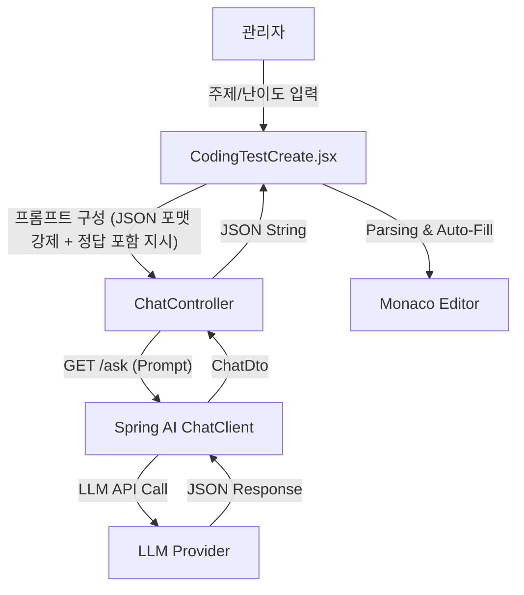

# 🧑‍💻 준서(Junseo) 백엔드 시스템 흐름 및 구조 상세 (Backend System Architecture)

이 문서는 **준서(wnstj999)**님이 구현한 백엔드 핵심 기능의 **데이터 흐름(Data Flow)**과 **파일 간 상호작용(Interaction)**을 중심으로, 시스템이 실제로 어떻게 동작하는지 면접관에게 설명할 수 있도록 구조화했습니다.
모든 로직은 **Controller → Service → Repository**의 계층형 아키텍처를 따르며, 각 단계에서 전달되는 데이터(Entity, DTO)를 명시했습니다.

---

## �️ 면접 대비: 시스템 동작 설명 가이드 (Script)

면접관이 "이 기능은 어떻게 구현되었나요?"라고 물었을 때, **입력(Input) -> 처리(Process) -> 출력(Output)** 순서로 명확하게 답변할 수 있는 스크립트입니다.

### 1. � Notice (공지사항) 시스템
*   **Q: 공지사항은 어떻게 관리되나요?**
*   **A:**
    1.  사용자가 공지사항 목록을 요청하면, **NoticeController**가 요청을 받아 Service 계층을 호출합니다.
    2.  **NoticeService**는 **DB에서 모든 공지를 가져온 뒤**, `VISIBLE` 상태인 것만 필터링(Stream API)하여 반환합니다.
    3.  이를 통해 관리자는 공지사항을 미리 작성해두고, 원하는 시점에 `VISIBLE`로 변경하여 사용자에게 노출할 수 있습니다.

### 2. ❓ QnA & Answer (질문과 답변) 시스템
*   **Q: 질문 등록 시 알림 처리는 어떻게 되나요?**
*   **A:**
    1.  학생이 질문을 등록하면 **QnaService**가 질문을 DB에 저장합니다.
    2.  저장이 완료되면 즉시 **NotificationService**를 호출하여 강좌 개설자(강사)에게 알림을 생성합니다.
    3.  반대로 강사가 답변을 달면, **QnaAnswerService**가 답변을 저장함과 동시에 원본 질문의 상태를 `ANSWERED`로 변경하고, 학생에게 알림을 보냅니다.
    4.  즉, **Service 간의 상호작용**을 통해 실시간 알림 시스템을 구현했습니다.

### 3. 🔐 Users (인증 및 보안) 시스템
*   **Q: 로그인 프로세스는 어떻게 동작하나요?**
*   **A:**
    1.  클라이언트가 ID/PW를 보내면, 제가 구현한 **ApiLoginFilter**가 JSON 데이터를 파싱하여 인증 토큰을 생성합니다.
    2.  Spring Security의 **AuthenticationManager**가 DB에 저장된 비밀번호와 비교 검증합니다.
    3.  검증에 성공하면 **ApiLoginSuccessHandler**가 실행되어 세션을 생성하고, **페이지 리다이렉트 없이 JSON 응답**만 프론트엔드에 전달합니다. (SPA 구조에 최적화)

### 4. 💻 Problem & Submission (코딩 테스트 엔진)
*   **Q: 사용자가 제출한 코드는 어떻게 실행되나요? (핵심 기능)**
*   **A:**
    1.  사용자가 코드를 제출하면 **ProblemController**가 받아서 **JavaNativeExecutor**라는 모듈을 호출합니다.
    2.  Executor는 `Files.createTempDirectory()`로 **격리된 임시 폴더**를 생성합니다.
    3.  `ProcessBuilder`를 사용해 외부 프로세스로 `javac`(컴파일)와 `java`(실행) 명령어를 실행합니다.
    4.  이때 **무한 루프 방지**를 위해 10초의 타임아웃을 설정했습니다.
    5.  실행 결과(표준 출력)를 캡처하여 문제의 정답과 비교하고, 그 결과를 채점하여 DB에 저장합니다.

### 5. 💳 Payment & Wallet (결제 및 지갑) 시스템
*   **Q: 결제 데이터 무결성은 어떻게 보장하나요?**
*   **A:**
    1.  프론트엔드에서 토스 결제 승인 후, 백엔드의 **PaymentService**가 토스 API를 호출하여 **결제 유효성(실제 승인 여부)**을 검증합니다.
    2.  검증이 통과되면, **WalletIntegrationService**가 **트랜잭션(@Transactional)**을 시작합니다.
    3.  이 트랜잭션 안에서 **[결제 기록 저장 + 사용자 포인트 충전 + 히스토리 생성]**이 원자적으로 수행됩니다.
    4.  만약 하나라도 실패하면 전체가 롤백되어 데이터 불일치를 방지합니다.

### 6. 🧠 AI Problem Generator (코딩 테스트 자동 생성) 시스템 🔥
*   **Q: AI로 문제를 생성하는 기능은 어떻게 구현했나요?**
*   **A:**
    1.  **입력 단계**: 관리자가 문제 주제(예: "정렬")와 난이도를 입력하고 "생성" 버튼을 누릅니다.
    2.  **프롬프트 엔지니어링**: React 프론트엔드에서 "너는 알고리즘 전문가다. 정답 코드를 포함해서 JSON으로 답해라"라는 **시스템 프롬프트**를 조립합니다.
    3.  **AI 통신**: 백엔드(`ChatController`)의 `/ask` API로 프롬프트를 보냅니다.
    4.  **Spring AI**: 백엔드는 **Spring AI** 라이브러리를 통해 LLM 모델과 통신하고 결과를 받아옵니다.
    5.  **자동 완성**: 프론트엔드는 응답받은 JSON을 파싱하여, 문제 제목/설명뿐만 아니라 **실행 가능한 정답 코드**까지 에디터에 자동으로 채워 넣습니다.
    6.  **검수**: 관리자는 AI가 짠 코드를 바로 실행해보고, 이상이 없으면 저장합니다. 이를 통해 **문제 출제 시간을 획기적으로 단축**했습니다.

---

## 📊 1. Notice (공지사항) 시스템 상세

### 🔄 시스템 흐름도 (Mermaid)
```mermaid
graph LR
    User[사용자] -->|GET /api/notice| Controller[NoticeController]
    Controller -->|getVisibleNotices()| Service[NoticeService]
    Service -->|findAll()| Repo[NoticeRepository]
    Repo -->|List&lt;Notice&gt;| DB[(Database)]
    Service -- Filter(VISIBLE) --> Controller
    Controller -- JSON --> User
```

### 📂 파일 간 상호작용 상세
1.  **NoticeController.java**
    *   **역할**: 클라이언트의 요청(`GET`, `POST`)을 받음.
    *   **동작**: 사용자가 목록을 요청하면 `NoticeService.getVisibleNotices()`를 호출합니다.
2.  **NoticeService.java**
    *   **로직**:
        1.  `NoticeRepository.findAllByOrderByCreatedAtDesc()`를 호출하여 **모든 공지**를 DB에서 가져옵니다.
        2.  가져온 목록 중 `status == NoticeStatus.VISIBLE`인 것만 **Stream API로 필터링**하여 반환합니다.
        3.  (관리자라면 `getAllNotices()`로 필터링 없이 모두 반환)

---

## 📊 4. Problem & Submission (코딩 테스트 엔진) 상세

### 🔄 시스템 흐름도 (Mermaid)
```mermaid
graph TD
    User -->|코드 제출| Controller[ProblemController]
    Controller -->|run(code)| Executor[JavaNativeExecutor]
    Executor -->|1. 임시폴더 생성| FS[File System]
    Executor -->|2. javac 컴파일| Process[외부 프로세스]
    Executor -->|3. java 실행| Process
    Process -->|Output/Error| Executor
    Executor -- 결과 반환 --> Controller
    Controller -->|save()| SubService[SubmissionService]
    SubService -->|저장| DB
```

### 📂 파일 간 상호작용 상세
1.  **ProblemController.java**
    *   **입력**: `ExecutionRequest` (소스코드, 입력값)
    *   **동작**: `JavaNativeExecutor.run()`을 호출해 코드를 실행합니다.
2.  **JavaNativeExecutor.java** (채점 엔진)
    *   **격리**: `Files.createTempDirectory()`로 **고유한 임시 폴더**를 만듭니다.
    *   **실행**: `ProcessBuilder`로 `javac`와 `java` 명령어를 실행합니다. 이때 타임아웃(10초)을 걸어 무한 루프를 방지합니다.
    *   **반환**: 실행 결과(표준 출력, 에러)를 `ExecutionResponse` 객체에 담아 반환합니다.
3.  **Controller (채점 로직)**
    *   `Executor`가 반환한 `output`과 문제의 `expectedOutput`을 비교합니다.
    *   일치하면 `PASS`, 다르면 `FAIL` 또는 `ERROR` 상태로 판정합니다.

---

## � 10. AI Problem Generator (코딩 테스트 자동 생성) 시스템 상세 🔥

### 🔄 시스템 흐름도 (Mermaid)



### 📂 파일 및 데이터 흐름 상세

1.  **Frontend (React) - `CodingTestCreate.jsx`**
    *   **Role**: **프롬프트 엔지니어링 수행**. AI에게 전달할 명령어를 여기서 조립합니다.
    *   **System Prompt 구성**:
        *   "너는 알고리즘 출제 전문가다."
        *   **제약 조건**: `Scanner` 사용 금지, `main` 메서드 내 테스트 케이스 하드코딩, 클래스명 `main` 고정.
        *   **Output Format**: 엄격한 **JSON 포맷**으로 제목, 설명, 정답 코드를 요구합니다.
    *   **Action**: 사용자가 "생성" 버튼을 누르면 `/ask` API를 호출합니다.
    *   **Post-Process**: 응답받은 JSON 문자열을 파싱하여, 문제 제목/설명/코드 에디터에 값을 **자동으로 채워 넣습니다**.

2.  **Backend (Spring Boot) - `ChatController.java`**
    *   **Role**: **LLM Gateway**. 프론트엔드의 요청을 받아 AI 모델과 통신합니다.
    *   **Endpoint**: `@GetMapping("/ask")`
    *   **Logic**:
        ```java
        // ChatController.java
        public ChatDto ask(@RequestParam String message) {
            String answer = chatClient.prompt().user(message).call().content();
            return new ChatDto(answer); // AI의 응답을 DTO로 포장하여 반환
        }
        ```
    *   **특징**: 이 컨트롤러는 "채팅" 기능뿐만 아니라, 프롬프트 내용에 따라 문제를 생성하는 등 **다목적 AI 인터페이스**로 활용됩니다.

3.  **Data Flow (데이터 흐름)**
    *   **Request**: `message="주제: 정렬, 난이도: 중급, 조건: 정답 코드 포함..."`
    *   **Response**:
        ```json
        {
          "title": "버블 정렬 구현하기",
          "baseCode": "public class main { ... solution() ... }", // 정답이 포함된 실행 가능한 코드
          "expectedOutput": "1 2 3 4 5"
        }
        ```
