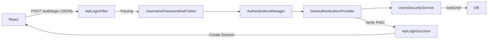

# 🧑‍💻 준서(Junseo) 백엔드 시스템 흐름 및 구조 상세 (Backend System Architecture)

이 문서는 **준서(wnstj999)**님이 구현한 백엔드 핵심 기능의 **데이터 흐름(Data Flow)**과 **파일 간 상호작용(Interaction)**을 중심으로, 시스템이 실제로 어떻게 동작하는지 면접관에게 설명할 수 있도록 구조화했습니다.
모든 로직은 **Controller → Service → Repository**의 계층형 아키텍처를 따르며, 각 단계에서 전달되는 데이터(Entity, DTO)를 명시했습니다.

---

## 1. 📢 Notice (공지사항) 시스템

사용자가 공지사항을 조회하고, 관리자가 등록하는 흐름입니다.

### 🔄 시스템 흐름도 (System Flow)
```mermaid
graph LR
    User[사용자] -->|GET /api/notice| Controller[NoticeController]
    Controller -->|getVisibleNotices()| Service[NoticeService]
    Service -->|findAll()| Repo[NoticeRepository]
    Repo -->|List&lt;Notice&gt;| DB[(Database)]
    Service -- Filter(VISIBLE) --> Controller
    Controller -- JSON --> User
```

### � 파일 간 상호작용 상세
1.  **NoticeController.java**
    *   **역할**: 클라이언트의 요청(`GET`, `POST`)을 받음.
    *   **동작**: 사용자가 목록을 요청하면 `NoticeService.getVisibleNotices()`를 호출합니다.
2.  **NoticeService.java** (핵심 비즈니스 로직)
    *   **역할**: 공지사항의 **노출 상태(VISIBLE/HIDDEN)**를 판단합니다.
    *   **로직**:
        1.  `NoticeRepository.findAllByOrderByCreatedAtDesc()`를 호출하여 **모든 공지**를 DB에서 가져옵니다 (`List<Notice>`).
        2.  가져온 목록 중 `status == NoticeStatus.VISIBLE`인 것만 **Stream API로 필터링**하여 반환합니다.
        3.  (관리자라면 `getAllNotices()`로 필터링 없이 모두 반환)
3.  **NoticeRepository.java**
    *   **역할**: DB와 직접 통신. JPA를 사용해 데이터를 조회/저장합니다.

---

## 2. ❓ QnA & Answer (질문과 답변) 시스템

질문을 등록하면 강사에게 알림이 가고, 답변이 달리면 학생에게 알림이 가는 **상호작용 구조**입니다.

### 🔄 시스템 흐름도 (System Flow)
```mermaid
graph TD
    Student[학생] -->|POST 질문| QController[QnaController]
    QController -->|create()| QService[QnaService]
    QService -->|save()| QRepo[QnaRepository]
    QService -->|createNotification()| NotiService[NotificationService]
    NotiService -->|Alert| Instructor[강사]
```

### 📂 파일 간 상호작용 상세
1.  **QnaController.java**
    *   **입력**: `QnaDto` (제목, 내용, 강좌ID)
    *   **동작**: `QnaService.create()`에 데이터를 전달합니다.
2.  **QnaService.java**
    *   **로직1 (저장)**: 전달받은 데이터로 `Qna` 엔티티를 생성하고 `QnaStatus.WAIT` 상태로 저장합니다.
    *   **로직2 (알림 트리거)**: 질문이 저장된 직후, 강좌 개설자(강사)에게 알림을 보내기 위해 **`NotificationService.createNotification()`을 호출**합니다. (서비스 간 통신)
3.  **QnaAnswerService.java**
    *   **로직**: 강사가 답변을 달면 `QnaAnswer` 엔티티를 저장하고, 원본 질문(`Qna`)의 상태를 `QnaStatus.ANSWERED`로 변경합니다 (**Dirty Checking**).

---

## 3. 🔐 Users (인증 및 보안) 시스템

Spring Security 필터 체인을 통해 로그인 요청을 가로채고 처리하는 **보안 파이프라인**입니다.

### � 시스템 흐름도 (System Flow)


### � 파일 간 상호작용 상세
1.  **SecurityConfig.java**
    *   **역할**: 전체 보안 설정. `ApiLoginFilter`를 필터 체인 앞단에 배치합니다.
2.  **ApiLoginFilter.java** (커스텀 필터)
    *   **동작**: 요청 스트림(`request.getInputStream()`)을 읽어 **JSON 데이터를 파싱**합니다. 아이디/비번을 추출해 인증 토큰을 만듭니다.
3.  **ApiLoginSuccess.java** (핸들러)
    *   **동작**: 인증 성공 시 실행됩니다. 세션(`HttpSession`)을 생성하고, 사용자 정보를 담은 **JSON 응답**을 클라이언트에 반환합니다 (페이지 리다이렉트 안 함).
4.  **SocialLoginService.java**
    *   **동작**: OAuth2 인증 후 리다이렉트된 사용자 정보를 받아서(Google/Kakao/Naver), 이메일로 기존 회원을 찾거나 **자동 회원가입** 시킵니다.

---

## 4. 💻 Problem & Submission (코딩 테스트 엔진)

사용자가 제출한 코드를 **격리된 환경에서 실행**하고 채점하는 핵심 엔진입니다.

### 🔄 시스템 흐름도 (System Flow)
```mermaid
graph TD
    User -->|코드 제출| Controller[ProblemController]
    Controller -->|run(code)| Executor[JavaNativeExecutor]
    Executor -->|1. 임시폴더 생성| FS[File System]
    Executor -->|2. javac 컴파일| Process[외부 프로세스]
    Executor -->|3. java 실행| Process
    Process -->|Output/Error| Executor
    Executor -- 결과 반환 --> Controller
    Controller -->|save()| SubService[SubmissionService]
    SubService -->|저장| DB
```

### � 파일 간 상호작용 상세
1.  **ProblemController.java**
    *   **입력**: `ExecutionRequest` (소스코드, 입력값)
    *   **동작**: `JavaNativeExecutor.run()`을 호출해 코드를 실행합니다.
2.  **JavaNativeExecutor.java** (채점 엔진)
    *   **격리**: `Files.createTempDirectory()`로 **고유한 임시 폴더**를 만듭니다.
    *   **실행**: `ProcessBuilder`로 `javac`와 `java` 명령어를 실행합니다. 이때 타임아웃(10초)을 걸어 무한 루프를 방지합니다.
    *   **반환**: 실행 결과(표준 출력, 에러)를 `ExecutionResponse` 객체에 담아 반환합니다.
3.  **Controller (채점 로직)**
    *   `Executor`가 반환한 `output`과 문제의 `expectedOutput`을 비교합니다.
    *   일치하면 `PASS`, 다르면 `FAIL` 또는 `ERROR` 상태로 판정합니다.
4.  **SubmissionService.java**
    *   **동작**: 채점 결과, 코드, 소요 시간 등을 `Submission` 엔티티로 저장합니다.

---

## 5. 💳 Payment & Wallet (결제 및 지갑) 시스템

외부 PG사 결제와 내부 포인트 시스템이 결합된 **이중 결제 구조**입니다.

### 🔄 시스템 흐름도 (System Flow)
```mermaid
graph TD
    Client -->|토스 결제 승인| PayCtrl[PaymentController]
    PayCtrl -->|confirm()| PayService[PaymentService]
    PayService -->|API Call| Toss[Toss Payments]
    Toss -- OK --> PayService
    PayService -->|chargePoints()| WalletService[WalletIntegrationService]
    WalletService -->|Update Balance| Wallet[UserWallet]
    WalletService -->|Insert Log| History[WalletHistory]
    PayService -->|Insert Payment| PayRepo[PaymentRepository]
```

### � 파일 간 상호작용 상세
1.  **PaymentController.java**
    *   **동작**: 프론트엔드에서 토스 결제 후 받은 `paymentKey` 등을 `PaymentService`로 전달합니다.
2.  **PaymentService.java**
    *   **검증**: 토스 서버에 승인 API를 호출하여 결제가 유효한지 확인합니다.
    *   **성공 시**: `WalletIntegrationService.chargePoints()`를 호출합니다.
    *   **캐싱**: 관리자 페이지용 결제 목록은 `ConcurrentHashMap`에 캐싱하여 조회 속도를 높입니다.
3.  **WalletIntegrationService.java** (트랜잭션 관리자)
    *   **역할**: **[결제 기록 + 지갑 잔액 변경 + 히스토리 생성]** 3가지 작업을 하나의 트랜잭션(`@Transactional`)으로 묶습니다. 하나라도 실패하면 전체 롤백됩니다.
4.  **UserWallet.java / WalletHistory.java**
    *   사용자의 실제 포인트 잔액과 변동 내역을 저장합니다.

---

## 6. 🤖 ChatBot (AI 챗봇) 시스템

### 🔄 시스템 흐름도 (System Flow)
```mermaid
graph LR
    User -->|질문| Controller[ChatController]
    Controller -->|prompt()| Client[Spring AI ChatClient]
    Client -->|API Call| LLM[OpenAI / LLM Model]
    LLM -- 응답 --> Client
    Client -- DTO 변환 --> User
```

### � 파일 간 상호작용 상세
1.  **ChatConfig.java**
    *   **설정**: `ChatClient` 빈(Bean)을 생성할 때 **시스템 프롬프트**("너는 시니어 개발자다...")를 주입합니다.
2.  **ChatController.java**
    *   **동작**: 사용자 메시지를 받아 `ChatClient`에 전달합니다.
    *   **예외 처리**: AI 서버 오류 발생 시, 프론트엔드가 깨지지 않도록 에러 메시지를 `ChatDto`에 담아 정상 응답처럼 반환합니다.

---

## 7. 📧 Mail (이메일 인증) 시스템

### 📂 파일 간 상호작용 상세
1.  **MailController.java**
    *   **동작**: 이메일 주소를 받아 `MailService.sendMail()`을 호출합니다.
    *   **세션**: 반환받은 인증번호를 `HttpSession.setAttribute("emailAuthNumber", number)`로 세션에 저장합니다.
2.  **MailService.java**
    *   **동작**: 6자리 난수를 생성하고, HTML 태그 문자열을 조합하여 `JavaMailSender`로 메일을 발송합니다.

---

## 8. 🖼️ Image (이미지 업로드) 시스템

### 📂 파일 간 상호작용 상세
1.  **ImageController.java**: `MultipartFile`을 받음.
2.  **ImageService.java**:
    *   **UUID 생성**: 파일명 중복 방지.
    *   **S3 업로드**: `S3Template`을 이용해 원본 파일을 AWS S3 버킷의 `original/` 경로에 업로드.
    *   **썸네일 생성**: `Thumbnailator` 라이브러리로 메모리에서 이미지를 리사이징한 후 `thumb/` 경로에 업로드.
    *   **URL 반환**: 업로드된 두 파일의 S3 URL을 Map으로 반환.

---

## 9. 🔔 Notification (알림) 시스템

### 📂 파일 간 상호작용 상세
*   **NotificationService.java**
    *   **역할**: 다른 모든 서비스(`QnaService`, `PaymentService` 등)에서 호출되는 **공통 지원 모듈**입니다.
    *   **동작**: `createNotification(user, type, message)` 메서드가 호출되면 알림 엔티티를 생성하여 DB에 저장합니다. 사용자는 나중에 이 목록을 조회합니다 (Polling 방식).
